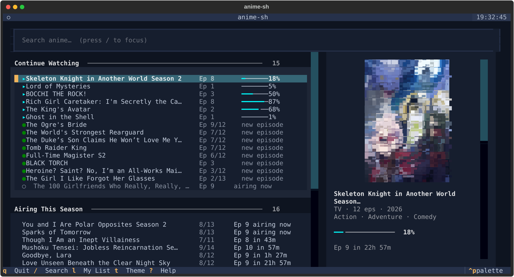
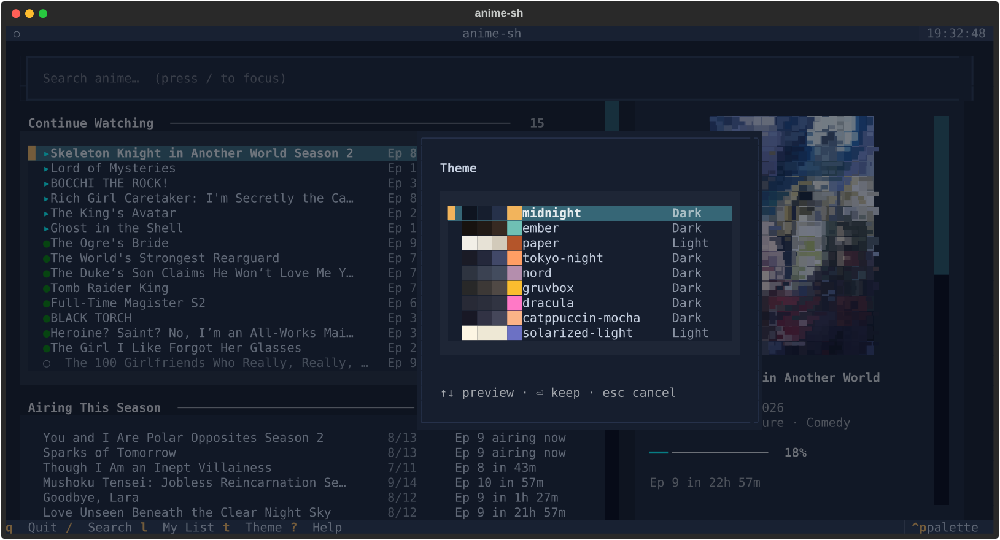

<div align="center">

# anime-sh

**Watch anime from your terminal.**<br>
Type a title — it finds a source, picks a mirror that works, and plays it in mpv.<br>
Providers, mirrors and resolvers are internal details you never have to think about.

[](https://pypi.org/project/anime-sh/)
[](https://pypi.org/project/anime-sh/)
[](https://github.com/Anime123450/anime-sh/actions/workflows/ci.yml)
[](https://github.com/Anime123450/anime-sh/actions/workflows/canary.yml)
[](LICENSE)



```powershell
scoop bucket add anime-sh https://github.com/Anime123450/scoop-anime-sh
scoop install anime-sh
```

*One command. No Python, no setup — mpv comes with it.*

</div>

---

## 📖 Contents

[Install](#-install) · [What you get](#-what-you-get) · [Themes](#-themes) · [Keys](#%EF%B8%8F-keys) · [First run](#-first-run) · [AniList sync](#-sync-across-devices-anilist) · [Commands](#-command-reference) · [How it behaves](#-how-it-behaves) · [Troubleshooting](#-troubleshooting) · [Develop](#%EF%B8%8F-develop)

---

## ⚡ Install

### Windows — one command

Nothing to set up first. Both of these install **mpv** alongside it, which is
what actually plays the video.

**[Scoop](https://scoop.sh)** — available now:

```powershell
scoop bucket add anime-sh https://github.com/Anime123450/scoop-anime-sh
scoop install anime-sh
```

**WinGet** — [pending review](https://github.com/microsoft/winget-pkgs/pull/426448); winget already ships with Windows 10 and 11:

```powershell
winget install AnimeshSharma.anime-sh
```

> **`anime` not recognised straight after a winget install?** It worked — winget
> changed your `PATH` and this terminal still has the old copy. Open a new one.
> Scoop needs no restart.

### Any OS — with Python

`uv` is a single standalone binary that brings its own Python, so this works on
a machine with no Python at all.

```bash
# Windows
winget install astral-sh.uv ; winget install shinchiro.mpv
# macOS
brew install uv mpv
# Linux
curl -LsSf https://astral.sh/uv/install.sh | sh && sudo apt install mpv

uv tool install "anime-sh[tui]"
anime doctor
```

<details>
<summary><b>Other ways in</b> — a single file, no terminal, or from source</summary>

<br>

**Just the executable.** Every [release](https://github.com/Anime123450/anime-sh/releases)
carries `anime-sh-<version>-windows-x64.exe` — about 21 MB, with Python and every
library inside it. Download and run; there is no install step. You still need
[mpv](https://mpv.io) on your `PATH`.

**No terminal at all.** Download this repo as a ZIP, unzip, and double-click
**`run-anime.bat`**. It installs whatever is missing and starts the app.

**Already have Python?** `pipx install "anime-sh[tui]"` works — though pipx is
itself a Python package, so it cannot be the *first* thing you install on a
clean machine.

**From source:**

```bash
git clone https://github.com/Anime123450/anime-sh.git && cd anime-sh
uv sync --extra tui
uv run anime
```

</details>

### What you need alongside it

| | Why | Required? |
|---|---|---|
| **[mpv](https://mpv.io)** | plays the video | **yes** — installed for you by scoop/winget |
| **[ffmpeg](https://ffmpeg.org)** | saves downloads | only for `anime download` |
| **Python 3.11+** | runs the app | only for the PyPI and source installs |

Not sure? Run **`anime doctor`** — it checks every one of these and prints the
exact command to install whatever is missing, for the package manager you
actually have.

---

## 🎬 What you get

| | |
|---|---|
| 🔎 **Forgiving search** | `atack on titan`, `dont toy with me` — it finds them anyway |
| 🎥 **Plays in mpv** | driven over JSON IPC, with your own mpv config respected |
| ⏭️ **Skips intros and outros** | and rolls straight into the next episode |
| 📚 **Remembers everything** | resume position, history, favourites — in a local database |
| 🔄 **AniList two-way sync** | finish an episode here, your phone knows |
| 🧩 **Multiple providers** | fanned out with circuit breakers; one site dying is not an outage |
| 🖼️ **Cover art in the terminal** | unicode block sextants — no special terminal required |
| 🎨 **Nine themes** | previewed live as you arrow through them |
| ⬇️ **Downloads** | ffmpeg-backed, resumable, and played back offline automatically |
| 🔌 **Plugin providers** | a provider is an entry point; adding one needs no fork |

---

## 🎨 Themes

Press **`t`**. Moving the cursor applies each theme to the whole app immediately,
so you choose by looking at anime-sh rather than at a list of names —
<kbd>Enter</kbd> keeps it, <kbd>Esc</kbd> puts back the one you arrived with.

<div align="center">

</div>

Three are anime-sh's own — **midnight** (the default), **ember**, and **paper**,
the light one — alongside tokyo-night, nord, gruvbox, dracula, catppuccin-mocha
and solarized-light.

```bash
anime themes                 # list them, marking the one in use
anime themes --set ember     # or set it without opening the app
```

---

## ⌨️ Keys

| Key | Does |
|---|---|
| <kbd>↑</kbd> <kbd>↓</kbd> / <kbd>j</kbd> <kbd>k</kbd> | move within a list |
| <kbd>g</kbd> / <kbd>G</kbd> | first / last row |
| <kbd>Tab</kbd> | next section |
| <kbd>Enter</kbd> | open a show, or play the highlighted episode |
| <kbd>/</kbd> | search |
| <kbd>Esc</kbd> | clear the search, or go back |
| <kbd>l</kbd> | your AniList list |
| <kbd>t</kbd> | theme picker |
| <kbd>?</kbd> | every key, any time |
| <kbd>q</kbd> | quit |

---

## 🚀 First run

```bash
anime            # the TUI: Continue Watching, Airing This Season, Trending
```

The right-hand panel follows your cursor — poster, what the show is, how far
into the episode you are, when the next one airs, and what <kbd>Enter</kbd> will
do. Below it, everything you are waiting on, grouped by day.

Prefer one-shot commands? `anime "Frieren"` searches, picks the best match and
plays episode 1. `anime play "Frieren" -e 18 --dub -q 1080p` is fully explicit.

Turn on shell tab-completion once: `anime --install-completion`.

---

## 📋 Command reference

<details>
<summary><b>Every command</b> — watch, discover, library, downloads, housekeeping</summary>

<br>

```bash
# Watch
anime                        # launch the TUI
anime "Frieren"              # search + best match + play episode 1
anime play "Frieren" -e 18   # a specific episode (add --dub, -q 1080p)
anime continue               # episodes you started but didn't finish
anime resume                 # jump back into the most recent one
anime next "Mob Psycho 100"  # find + play the next season
anime sources "Frieren"      # every provider entry that matches, before playing

# Discover
anime search "frieren"       # AniList search (instant; no providers touched)
anime search --genre action --year 2024 --sort score
anime trending
anime seasonal               # this season (or: --season fall --year 2025)
anime calendar --days 7      # what airs next, and when
anime random                 # picked from what's trending
anime recommend "Frieren"    # shows for people who liked it
anime related "Attack on Titan"  # prequels, sequels, side stories, movies

# Library & tracking
anime mark "Frieren" -e 12    # mark eps 1–12 watched (syncs to AniList)
anime unmark "Frieren"        # clear local progress for a show
anime history                 # what you've watched
anime favorite add "Frieren"  # ★  (also: favorite ls / rm)
anime stats                   # episodes, hours, top genres & providers
anime rate "Frieren" 9        # set a score;  anime status "X" completed

# AniList
anime auth login              # link AniList (one-time); status / logout
anime sync pull | push        # import your list / send yours up
anime list --status watching  # your AniList list

# Downloads
anime download "Frieren" -e 1-12  # save a range (ffmpeg); resumes, skips done
anime download "Frieren" -e 1,3,5 # or a list;  also: anime downloads
anime play "Frieren" -e 1          # plays your download if you have it
anime play "Frieren" -e 1 --stream # ignore the local copy, fetch it anyway

# Appearance
anime themes                  # list themes, marking the current one
anime themes --set ember      # change it without opening the TUI

# Housekeeping
anime doctor                  # player, ffmpeg, config, database, plugins
anime --version
anime config get              # dump settings;  config get playback.quality
anime config set playback.quality 1080p
anime config path | validate
anime providers ls            # installed providers, and which are switched off
anime providers disable anizone   # stop using one without uninstalling it
anime cache info              # how much is cached, how much of it is stale
anime cache prune             # drop only expired entries — always safe
anime cache clear             # wipe it entirely (asks first; -y to skip)
```

Add `--json` to `search`, `trending`, `play`, `continue`, `history`, `themes`
and `favorite ls` for machine-readable output (`play --json` resolves the stream
without launching a player).

</details>

---

## 🧠 How it behaves

**Forgiving search.** You don't have to spell titles the way AniList stores
them. When its strict search comes up empty, anime-sh retries with apostrophes
restored and the query's distinctive words, then fuzzy-ranks what comes back
against what you typed.

**Multiple providers, merged.** anime-sh fans out across providers (currently
**anikoto + AniZone**) and falls through to whichever one actually has your
show, so a title missing from one source still plays from another with no action
from you.

> Streaming providers break and get Cloudflare-gated constantly — that is the
> normal operating state, not a bug. The **Providers** badge above is a nightly
> probe of the real sites; it going red means a site blocked us, not that the
> build broke. When a provider is unreachable anime-sh degrades cleanly, and
> metadata and your library keep working.

**Offline-friendly.** Your library lives in its own `anime.db`, separate from a
disposable `cache.db` of AniList responses. Recently-seen pages still render with
no network, and nothing you own lives in the cache — `cache prune` drops what
expired, `cache clear` empties it and hands the disk space back.

---

## 🩺 Troubleshooting

| Symptom | What's happening |
|---|---|
| **`anime` not recognised right after installing** | The install worked; your shell has a stale `PATH`. Open a new terminal (winget), or run `uv tool update-shell` (uv). |
| **`doctor` says mpv not found** | Nothing plays without it. `doctor` prints the exact command for your package manager — or `scoop install mpv` / `winget install shinchiro.mpv`. |
| **A show won't play — "trying next…" on every source** | Providers get Cloudflare-gated or geo-blocked. Try later, or another title; search and your library are unaffected. |
| **`pipx` / `pip` "not recognised"** | The wrong starting point on a clean machine — both *are* Python packages. Use scoop/winget, or the `uv` block above. |
| **Windows: blocked by Smart App Control** | Invoke it as a module: `python -m anime_sh <command>`. |
| **Nothing in Continue Watching from your phone** | Link AniList (`anime auth login`), then `anime sync pull`. |

**Updating and removing:**

```bash
scoop update anime-sh          # or: uv tool upgrade anime-sh
scoop uninstall anime-sh       # or: uv tool uninstall anime-sh
```

Your library and settings live outside the install (`anime config path`), so
upgrading never touches them.

---

## 🛠️ Develop

```bash
git clone https://github.com/Anime123450/anime-sh.git && cd anime-sh
uv sync --extra dev --extra tui
uv run python -m pytest -q   # unit + contract suite (no network)
uv run lint-imports          # architecture contracts (must stay green)
```

`ANIME_SH_LIVE=1` runs the gated live-provider tests.

**Architecture.** anime-sh is layered `cli/tui → app → domain`, with `infra`,
`providers` and `resolvers` as swappable adapters behind ports. Dependencies
point downward only, and that is enforced in CI. Identity comes from AniList —
every show is keyed by its AniList id — so adding a provider means attaching a
source to a known identity, not fuzzy-matching titles.

📄 [Architecture](docs/architecture.md) · [Writing a plugin](docs/plugins.md) · [Engineering standards](docs/ENGINEERING_STANDARDS.md) · [Contributing](CONTRIBUTING.md) · [Packaging](packaging/README.md)

The engineering standards are worth reading even if you never contribute — each
rule names the bug that caused it.

---

## ⚖️ Legal

anime-sh is a **client**, not a content library. It bundles no media, mirrors
nothing, and bypasses no DRM. Providers read public pages and are expected to
break; a broken provider is a degraded experience, not an outage. Provider
plugins are separable from the core, so the project survives any single one.

mpv and ffmpeg are declared as dependencies, never redistributed — both are
GPL-licensed, and shipping their binaries inside an MIT release would carry
obligations that depending on them does not.

---

<div align="center">

[Changelog](CHANGELOG.md) · [Releases](https://github.com/Anime123450/anime-sh/releases) · [Security](SECURITY.md) · [Code of conduct](CODE_OF_CONDUCT.md)

**[MIT](LICENSE)**

</div>
