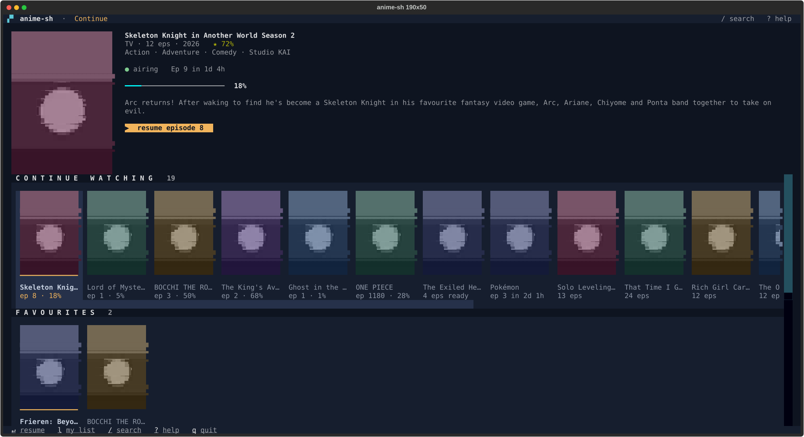
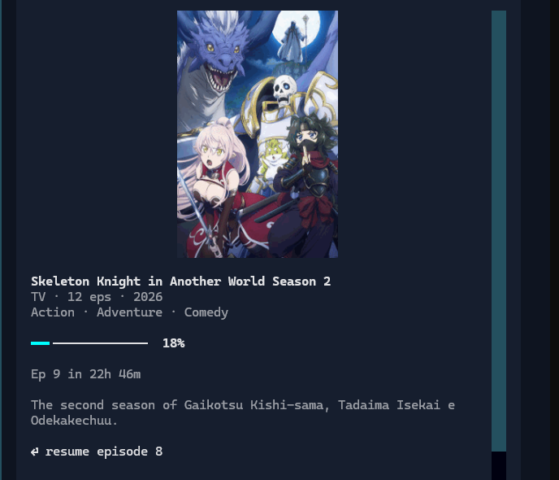

<div align="center">

# anime-sh

### Watch anime from your terminal.

Type a title. It finds a source, picks a mirror that works, and plays it in mpv.<br>
Providers, mirrors and resolvers are plumbing you never have to think about.

[](https://pypi.org/project/anime-sh/)
[](https://pypi.org/project/anime-sh/)
[](https://pypi.org/project/anime-sh/)
[](https://github.com/Anime123450/anime-sh/actions/workflows/ci.yml)
[](https://github.com/Anime123450/anime-sh/actions/workflows/canary.yml)
[](LICENSE)



</div>

---

## 🚀 One line, from nothing

Both of these work on a machine with nothing on it. No Python, no administrator,
no editing `PATH` by hand. mpv is installed alongside, because without it nothing
plays.

**Windows** — paste into a normal PowerShell, not an administrator one:

```powershell
irm https://raw.githubusercontent.com/Anime123450/anime-sh/master/install.ps1 | iex
```

**macOS and Linux:**

```bash
curl -LsSf https://raw.githubusercontent.com/Anime123450/anime-sh/master/install.sh | sh
```

Then run `anime`.

<details>
<summary><b>What those scripts do</b> — and how to check one before you run it</summary>

<br>

Piping a script off the internet into your shell deserves a look first. Both
take `--dry-run`, which prints every step and changes nothing:

```powershell
irm https://raw.githubusercontent.com/Anime123450/anime-sh/master/install.ps1 -OutFile install.ps1
.\install.ps1 -DryRun
```

```bash
curl -LsSf https://raw.githubusercontent.com/Anime123450/anime-sh/master/install.sh -o install.sh
sh install.sh --dry-run
```

They are [`install.ps1`](install.ps1) and [`install.sh`](install.sh) in this
repo, short enough to read in a minute.

**On Windows** it installs [Scoop](https://scoop.sh) if you do not have it, adds
the `extras` bucket (mpv lives there) and the anime-sh bucket, then installs
anime-sh and mpv. Scoop is per-user, so nothing prompts for administrator and
nothing is written outside your own profile.

**On macOS and Linux** it installs mpv with whatever package manager you already
have — Homebrew, apt, dnf, pacman, zypper or apk — then installs
[uv](https://docs.astral.sh/uv/) and installs anime-sh with it. uv brings its own
Python, so none needs to be on the system.

Both re-read `PATH` before finishing, so `anime` works in the window you ran them
from rather than only the next one. Both are safe to run twice: a second run
upgrades. Add `-WithFfmpeg` or `--with-ffmpeg` to also install ffmpeg, which only
`anime download` needs.

</details>

---

## 📖 Contents

[⚡ Install](#-install) · [🔌 PATH](#-will-anime-be-on-my-path) · [▶️ A minute with it](#%EF%B8%8F-a-minute-with-it) · [🎬 What you get](#-what-you-get) · [🚀 First run](#-first-run) · [⌨️ Keys](#%EF%B8%8F-keys) · [🎨 Themes](#-themes) · [🔗 AniList](#-linking-anilist-optional) · [📋 Commands](#-command-reference) · [⚙️ Config](#%EF%B8%8F-config) · [🩺 Troubleshooting](#-troubleshooting) · [🛠️ Develop](#%EF%B8%8F-develop)

---

## ⚡ Install

Prefer to drive your own package manager? Each of these is live.

| | Channel | Platform | Brings mpv | `anime` on `PATH` |
|---|---|---|---|---|
| 🥄 | **Scoop** | Windows | ✅ | ✅ straight away |
| 🍫 | **Chocolatey** | Windows | ✅ | ✅ after a new terminal |
| 🍺 | **Homebrew** | macOS · Linux | ✅ | ✅ straight away |
| 🐍 | **uv** | any | ❌ | ✅ via `uv tool update-shell` |
| 📦 | **pipx** | any | ❌ | ✅ via `pipx ensurepath` |
| 🐧 | **AUR** | Arch | ✅ | ✅ straight away |
| 🧱 | **Single `.exe`** | Windows | ❌ | ❌ you pick where it lives |

### 🥄 Scoop — the quickest route on Windows

```powershell
# Skip these two if you already have Scoop.
Set-ExecutionPolicy -ExecutionPolicy RemoteSigned -Scope CurrentUser
Invoke-RestMethod -Uri https://get.scoop.sh | Invoke-Expression

scoop bucket add extras
scoop bucket add anime-sh https://github.com/Anime123450/scoop-anime-sh
scoop install anime-sh
```

> Use a **normal** PowerShell. Scoop installs per-user and refuses to run
> elevated.
>
> The first line is what stops Windows refusing the second one with a message
> about running scripts being disabled. It applies to your account only, and
> `RemoteSigned` still requires downloaded scripts to be signed — it is what
> Microsoft ships on Windows Server. Answer `Y` when it asks.
>
> The `extras` bucket is not optional. mpv lives there, a fresh Scoop has only
> `main`, and anime-sh declares mpv as a dependency — so without that bucket the
> install stops on something it cannot resolve.

Scoop's shims directory went on your `PATH` when you installed Scoop, so `anime`
works immediately in the same window.

### 🍫 Chocolatey

```powershell
choco install anime-sh
```

mpv comes with it. For downloads, `choco install ffmpeg`.

> Chocolatey edits the machine `PATH`, which your current terminal read when it
> started. Open a new one.

### 🍺 Homebrew — macOS and Linux

```bash
brew tap Anime123450/anime-sh
brew install anime-sh
```

mpv comes with it. For downloads, `brew install ffmpeg`.

> **This builds from source: 10–20 minutes.** Two CI runs of 0.2.89 measured
> 11m and 12m on macOS, 14m and 20m on Linux — runner speed is most of the
> spread. A tap carries no prebuilt bottles, so Homebrew builds anime-sh and any
> dependency it cannot pour — `pydantic-core` is Rust, and it is most of that
> time. Upgrades reuse what is already built.
>
> It used to be closer to an hour, almost all of it compiling `Pillow`; 0.2.89
> pours Homebrew's instead.
>
> If that is still unappealing, the one-liner at the top uses uv and finishes
> in seconds.

### 🐍 uv — any OS, no Python needed

uv is one standalone binary that brings its own Python, so this works on a
machine with no Python at all.

```bash
# 1. uv, and mpv
curl -LsSf https://astral.sh/uv/install.sh | sh    # macOS / Linux
brew install mpv                                   # or apt / dnf / pacman

# 2. anime-sh
uv tool install "anime-sh[tui]"

# 3. put it on PATH, once
uv tool update-shell
```

On Windows the same thing, with `winget install astral-sh.uv` and
`winget install shinchiro.mpv` for step 1.

> **Do not drop the `[tui]`.** Without it `anime` still installs and
> `anime --version` still answers, so a missing extra is easy to miss until the
> interface refuses to start.
>
> `uv tool update-shell` edits the right profile for your shell. Open a new
> terminal afterwards, or `export PATH="$HOME/.local/bin:$PATH"` for this one.

### 📦 pipx

```bash
pipx install "anime-sh[tui]"
pipx ensurepath
```

> pipx is itself a Python package, so it cannot be the *first* thing installed on
> a clean machine. Already have it? Then this is fine.

### 🐧 Arch

```bash
yay -S anime-sh    # or: paru -S anime-sh
```

<details>
<summary><b>Other ways in</b> — one file, no terminal, or from source</summary>

<br>

**Just the executable.** Every [release](https://github.com/Anime123450/anime-sh/releases)
carries `anime-sh-<version>-windows-x64.exe`, about 21 MB with Python and every
library inside it. Download it and run it; there is no install step. You still
need [mpv](https://mpv.io) on your `PATH`, and since you chose where the `.exe`
lives, putting that on `PATH` is yours to do as well.

**No terminal at all.** Download this repo as a ZIP, unzip, double-click
**`run-anime.bat`**. It installs what is missing and starts the app.

**From source:**

```bash
git clone https://github.com/Anime123450/anime-sh.git && cd anime-sh
uv sync --extra tui
uv run anime
```

</details>

---

## 🔌 Will `anime` be on my `PATH`?

Yes, with every method except the bare `.exe`. The longer answer earns its space,
because "command not found straight after installing" is the most common thing
people hit and it is almost never a broken install.

**Why it happens.** A program is found by searching the directories in `PATH`.
An installer adds its directory to the *stored* `PATH`, but a terminal reads that
value once, when it opens. Your terminal is still holding the old copy. The
install worked. The window has not heard about it.

| Installed with | What to do |
|---|---|
| One-line installer | Nothing. Both scripts re-read `PATH` before finishing. |
| Scoop | Nothing. The shims directory went on `PATH` with Scoop itself. |
| Chocolatey | Open a new terminal. |
| Homebrew | Nothing, as long as `brew` works in that shell. |
| uv | `uv tool update-shell` once, then a new terminal. |
| pipx | `pipx ensurepath` once, then a new terminal. |
| Bare `.exe` | Add its folder to `PATH`, or run it by full path. |

Repair the window you already have, without restarting it:

```powershell
# Windows
$env:Path = [Environment]::GetEnvironmentVariable('Path','Machine') + ';' +
            [Environment]::GetEnvironmentVariable('Path','User')
```

```bash
# macOS / Linux
export PATH="$HOME/.local/bin:$PATH"
```

> **Two copies?** Install with two managers and `anime` exists twice, with `PATH`
> order quietly deciding which runs — so upgrading one can look like it did
> nothing at all. `where.exe anime` on Windows, `which -a anime` on Unix, lists
> every match. The Windows one-line installer warns about this rather than
> silently adding a second.

### What you need alongside it

| | | Why | Required? |
|---|---|---|---|
| 🎥 | **[mpv](https://mpv.io)** | plays the video | **yes** — every package manager above brings it |
| ✂️ | **[ffmpeg](https://ffmpeg.org)** | saves downloads | only for `anime download` |
| 🐍 | **Python 3.11+** | runs the app | only for the uv, pipx and source installs |

**`anime doctor`** checks all of them and prints the exact command for whichever
package manager you actually have. **`anime doctor --streams`** goes further and
plays something through each provider from your own connection, which answers
"is it broken, or is it me?"

---

## ▶️ A minute with it

<div align="center">


<sub>Home · search-as-you-type · a show's episodes, in two of the three layouts</sub>

</div>

Every frame is the real application, rendered and captured from the app itself.
Not a mockup of it.

---

## 🎬 What you get

| | |
|---|---|
| 🔎 **Forgiving search** | `atack on titan`, `dont toy with me` — it finds them anyway |
| 🎥 **Plays in mpv** | driven over JSON IPC, and your own mpv config still applies |
| ⏭️ **Skips intros and outros** | then rolls straight into the next episode |
| 📚 **Remembers everything** | resume position, history and favourites, in a local database |
| 🔄 **AniList two-way sync** | finish an episode here and your phone knows |
| 🧩 **Multiple providers** | fanned out behind circuit breakers, so one site dying is not an outage |
| 🖼️ **Cover art in the terminal** | unicode block sextants, sharper again on Sixel or kitty |
| 🎨 **Nine themes** | previewed live as you arrow through them |
| 🧱 **Layouts that fit you** | episodes as a grid, a list or compact; two home densities |
| ⬇️ **Downloads** | ffmpeg-backed, resumable, played back offline automatically |
| 🎒 **Stocks up before you ask** | `prefetch` saves the next episode of everything you are watching |
| 📊 **Your year, wrapped** | streaks, top shows and busiest day, as a shareable SVG card |
| 🔌 **Plugin providers** | a provider is an entry point, so adding one needs no fork |

---

## 🚀 First run

```bash
anime            # the TUI
```

Four shelves down the left — Continue Watching, Favourites, This Season,
Trending — each showing a sample, with its label counting the rest: *10 of 18*.
Press <kbd>z</kbd> to give one the whole screen, or a digit to jump straight to
it. Continue Watching gets the most room, because it is usually why you opened
the app.

The hero column on the right follows your cursor: poster, what the show is, how
far into the episode you got, when the next one airs, and what <kbd>Enter</kbd>
will do. Under it sits everything you are waiting on, grouped by day. The bottom
row always says what the thing under the cursor can do — it changes as you move.

It fits what it is given. At 80 columns the shelves fill the window on their own;
the rail appears at 120, labels itself at 160, and past that the extra width
becomes margin rather than more columns of data.

Prefer one-shot commands? `anime "Frieren"` searches, takes the best match and
plays episode 1. `anime play "Frieren" -e 18 --dub -q 1080p` spells it all out.

Shell tab-completion is one command: `anime --install-completion`.

---

## ⌨️ Keys

| | Key | Does |
|---|---|---|
| 🕹️ | <kbd>↑</kbd> <kbd>↓</kbd> / <kbd>j</kbd> <kbd>k</kbd> | move within a list |
| ⤒ | <kbd>g</kbd> / <kbd>G</kbd> | first / last row |
| ↹ | <kbd>Tab</kbd> / <kbd>Shift</kbd>+<kbd>Tab</kbd> | next / previous shelf |
| 🔢 | <kbd>1</kbd> <kbd>2</kbd> <kbd>3</kbd> <kbd>4</kbd> | jump to a shelf, as numbered on the rail |
| ⤢ | <kbd>z</kbd> | expand this shelf to the whole screen, or collapse it |
| ▶️ | <kbd>Enter</kbd> | open a show, or play the highlighted episode |
| 🔎 | <kbd>/</kbd> | search |
| ↩️ | <kbd>Esc</kbd> | clear the search, or go back |
| 📺 | <kbd>l</kbd> | your AniList list |
| 🎨 | <kbd>t</kbd> | theme picker |
| 🧩 | <kbd>p</kbd> | providers — which sources get searched |
| 🧱 | <kbd>v</kbd> | view — home density, or episode layout on a show |
| ⏭️ | <kbd>n</kbd> | next season, on a show |
| ❓ | <kbd>?</kbd> | every key, any time |
| 🎛️ | <kbd>Ctrl</kbd>+<kbd>P</kbd> | command palette |
| 🚪 | <kbd>q</kbd> | quit |

---

## 🎨 Themes

Press <kbd>t</kbd>. Moving the cursor applies each theme to the whole app at
once, so you choose by looking at anime-sh rather than at a list of names.
<kbd>Enter</kbd> keeps it, <kbd>Esc</kbd> restores the one you arrived with.

Three are anime-sh's own — **midnight** (the default), **ember** and **paper** —
next to tokyo-night, nord, gruvbox, dracula, catppuccin-mocha and
solarized-light.

<div align="center">

</div>

Cover art is drawn with unicode block sextants, so no special terminal is
required. On Sixel or kitty terminals it sharpens automatically.

---

## 🔗 Linking AniList (optional)

Everything works without an account. Linking one adds two-way sync: finish an
episode here and your phone knows, and `anime sync pull` brings in whatever you
have been watching elsewhere.

**anime-sh ships no API credentials, and there is no shared app to sign in
through.** You create your own client. It takes about a minute, and it means the
token belongs to you:

1. Open [AniList → Settings → Developer](https://anilist.co/settings/developer)
   and create a client.
2. **Name:** anything. **Redirect URL:** `https://anilist.co/api/v2/oauth/pin`
3. Link it:

```bash
anime auth login --client-id <YOUR_ID> --secret <YOUR_SECRET>
```

The token is written to your own config directory with `0600` permissions, goes
nowhere but AniList, and `anime auth logout` deletes it. Nothing about your
account is stored in this project.

---

## 📋 Command reference

<details>
<summary><b>Every command</b> — watch, discover, library, downloads, housekeeping</summary>

<br>

```bash
# ▶️  Watch
anime                          # the TUI
anime "Frieren"                # search, best match, play episode 1
anime play "Frieren" -e 18     # a specific episode
anime play "Frieren" --dub -q 1080p
anime resume                   # pick up the show you watched most recently
anime continue                 # what to watch next in every show you have going
anime sources "Frieren"        # every provider entry that matches
anime next "Frieren"           # find and play the sequel

# 🔭  Discover
anime search "frieren"         # AniList search, no providers touched
anime trending
anime seasonal                 # defaults to the current season
anime calendar                 # what is airing, and when
anime random
anime recommend "Frieren"
anime related "Frieren"

# 📚  Library and tracking
anime history
anime stats                    # what you watched here, plus your tracker's total
anime wrapped                  # your year, with a shareable SVG card
anime favorite add "Frieren"
anime favorite list
anime unmark "Frieren"         # clear local progress for a show

# 🔗  AniList
anime auth login --client-id <ID> --secret <SECRET>
anime auth logout
anime list --status watching
anime rate "Frieren" 9
anime status "Frieren" completed
anime sync push                # episodes you finished  ->  AniList
anime sync pull                # AniList  ->  local library

# ⬇️  Downloads
anime download "Frieren" -e 1-12
anime downloads                # what is already on disk
anime prefetch                 # next episode of everything you are watching

# 🎨  Appearance
anime themes

# 🧹  Housekeeping
anime doctor                   # player, ffmpeg, cover art, config, database, plugins
anime doctor --streams         # actually play through each provider
anime providers health         # circuit-breaker state per provider
anime config get ui.theme
anime config set ui.theme ember
anime --install-completion
```

</details>

---

## ⚙️ Config

`anime config set <section>.<key> <value>` writes one; `anime config get` reads
it back. Only keys you set are stored, so defaults can keep improving without
your file pinning them in place.

| Section | Keys |
|---|---|
| `player` | `name`, `args` |
| `playback` | `quality`, `audio`, `auto_next`, `skip_intro`, `skip_outro`, `prefer_downloads` |
| `providers` | `parallel`, `preferred`, `disabled`, `timeout_s`, `match_timeout_s`, `hianime_base` |
| `resolvers` | `disabled` |
| `ui` | `theme`, `episodes`, `density` |
| `downloads` | `dir` |

```bash
anime config set playback.audio dub
anime config set playback.quality 1080p
anime config set ui.episodes grid
anime config set downloads.dir ~/Videos/anime
```

Any of them can be set by environment variable instead, which is the easier
route for one-off runs and for scripts that should not touch your config file.
The name is `ANIME_SH_`, the section, two underscores, then the key — and it wins
over the file for that one setting, leaving the rest of your config alone.

```bash
ANIME_SH_PLAYBACK__AUDIO=dub anime play "Frieren"
ANIME_SH_UI__THEME=nord anime
```

When more than one of them sets the same thing, the winner is, highest
first: a flag on the command line, an environment variable, your config file,
the built-in default.

---

## 🩺 Troubleshooting

| | Symptom | What is going on |
|---|---|---|
| 🤔 | **`anime` not recognised right after installing** | The install worked; your shell has a stale `PATH`. See [PATH](#-will-anime-be-on-my-path). |
| 🎥 | **`doctor` says mpv not found** | Nothing plays without it. `doctor` prints the right command for your package manager, or use `scoop install mpv` / `brew install mpv` / `choco install mpvio`. |
| 🧊 | **A show will not play** | Plain `anime doctor` now carries a `provider health` line reading what the circuit breaker already learned on previous runs — it names any provider that is open or half-open and how many failures got it there, without touching the network. `anime doctor --streams` goes further and actually plays through each provider from your connection. A dead provider is normal and the fan-out routes past it; `anime providers health` shows the full counts. |
| 🔇 | **Dub not playing** | `anime config set playback.audio dub`, or pass `--dub` per run. Not every provider carries one. |
| 🐍 | **`pipx` or `pip` "not recognised"** | The wrong starting point on a clean machine — both *are* Python packages. Use the one-liner at the top, or scoop/choco. |
| 🖼️ | **Cover art looks blocky** | `anime doctor` — run on its own, not piped — says which renderer the TUI will use. `unicode blocks` with no complaint beside it means your terminal reported no Sixel or kitty graphics, and that fallback is doing its job. A ✗ saying textual-image *did not record a finished capability probe* means a bitmap was refused rather than drawn: reinstall with `uv tool install --force "anime-sh[tui]"`, and report the line if it survives that. `true bitmap` alongside a blocky poster is a bug worth reporting. `ANIME_SH_NO_GRAPHICS=1` forces the blocks. |
| 🧵 | **Cover art is sharp but slightly soft** | `doctor` also prints the character-cell size posters are scaled against. Posters are scaled to that size, so a wrong one has the terminal resampling the image. `10×20px` is the only reading that is ambiguous — it is both a real answer (Windows Terminal replies exactly that) and textual-image's fallback when nothing replies. If your cells are not that size, set `TEXTUAL_CELL_WIDTH` and `TEXTUAL_CELL_HEIGHT` to the real one. |
| 📺 | **Two `anime` commands** | Installed with two managers. `where.exe anime` or `which -a anime` finds both; remove the one you do not want. |

---

## 🛠️ Develop

```bash
git clone https://github.com/Anime123450/anime-sh.git && cd anime-sh
uv sync --extra dev --extra tui
uv run pytest -q          # the full suite
uv run lint-imports       # layering contracts
uv run anime
```

The architecture is layered, and the layering is enforced rather than
aspirational: `cli > tui > app > domain`, with `infra`, `providers` and
`resolvers` as adapters. `uv run lint-imports` fails the build when a layer
reaches somewhere it should not.

Providers and resolvers are found through entry points (`anime_sh.providers`,
`anime_sh.resolvers`), so a new one is just a package that declares one.

A nightly canary plays a real episode through every provider and opens an issue
when one breaks. It fails the run only when *nothing* can play, because a single
provider dying is the normal operating state here, and an alert that fires every
night is one nobody reads.

📄 [Architecture](docs/architecture.md) · [Writing a plugin](docs/plugins.md) · [Engineering standards](docs/ENGINEERING_STANDARDS.md) · [Contributing](CONTRIBUTING.md) · [Packaging](packaging/README.md)

The engineering standards are worth a read even if you never contribute — every
rule names the bug that caused it.

---

## ⚖️ Legal

anime-sh is a **client**, not a content library. It bundles no media, mirrors
nothing, and bypasses no DRM. Providers read public pages and are expected to
break; a broken provider is a degraded experience rather than an outage, and
provider plugins are separable from the core, so the project outlives any one of
them.

mpv and ffmpeg are declared as dependencies and never redistributed. Both are
GPL-licensed, and shipping their binaries inside an MIT release would carry
obligations that depending on them does not.

Not affiliated with AniList, mpv, or any provider.

---

<div align="center">

[Changelog](CHANGELOG.md) · [Releases](https://github.com/Anime123450/anime-sh/releases) · [Security](SECURITY.md) · [Code of conduct](CODE_OF_CONDUCT.md)

**[MIT](LICENSE)**

</div>
